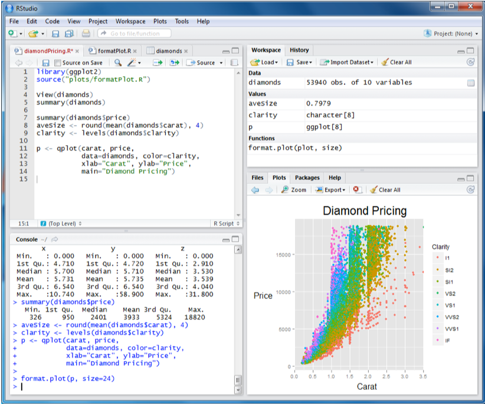
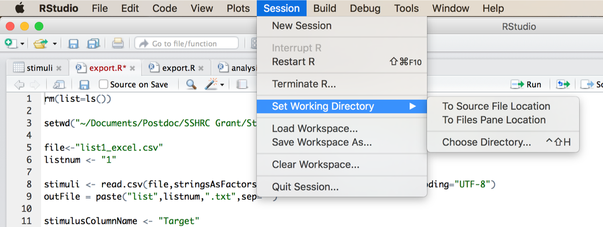
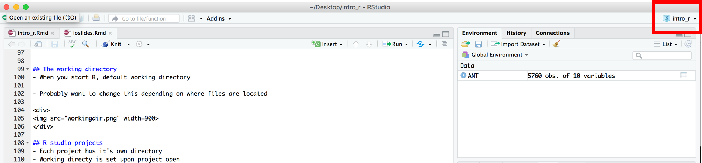
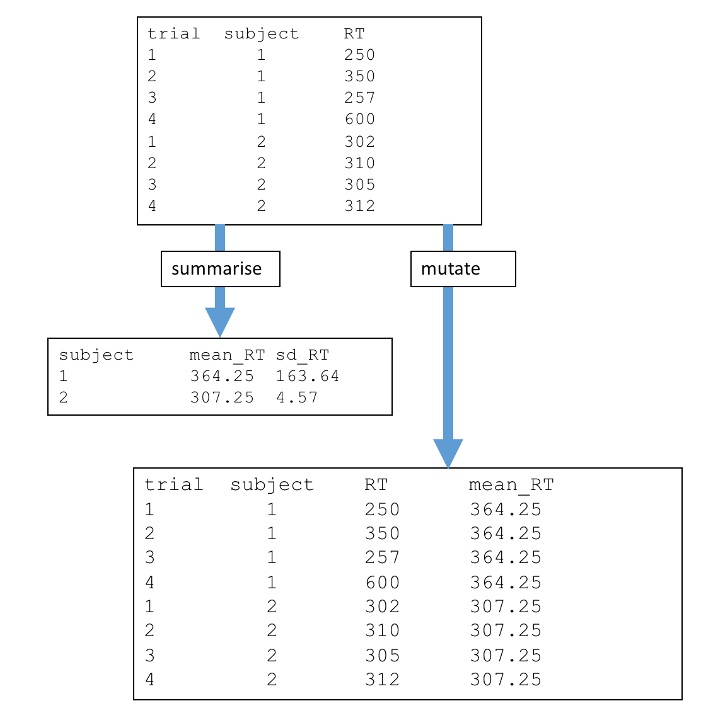

<style>
div#before-column p.forceBreak {
    break-before: column;
}
div#after-column p.forceBreak {
    break-after: column;
}
</style>

```{r setup, include=FALSE}
knitr::opts_chunk$set(echo = FALSE)
```

# Quick overview about R

## What is R
- Software environment for statistical computing and graphics
- Runs on multiple platforms (Linux Mac, Windows)
- Download R: http://www.r-project.org/
- Download R Studio: https://www.rstudio.com/

```{r, out.width = "400px"}

```

## Common situation
- Hours preparing data by-hand 
- You calculated your means for each subject in each condition, with error bars
- You even found that error where you calculated the mean from the wrong column
- Your spreadsheet is awesome

Advisor: “I think we should exclude xyz trial type” -or- “for our next meeting, we need to see  this condition broken down”

<div align="center">

</div>

## Solutions {.columns-2}
<div>

<figcaption>With Excel</figcaption>
</div>

<p class="forceBreak"></p>

<div>

<figcaption>With R Scripts</figcaption>
</div>

## Why use R vs. Excel?
- Minimize human error
    - R: Mistakes often apply evenly over the dataset (e.g., common offset for everyone)
    - R: Useful if initially cryptic Error messages
    - Excel: prone to tiny copy paste mistakes

- Replicability
    - Script / text file that you make to accomplish the procedure
    - Ask yourself: Will I be doing this again?

## Why use R vs. Excel?
- Speed
    - Excel: slowdown for large sheets with many formulas
    - R: Routines for reading bigger data
    - R: Parallelization to speed up operations

## Other reasons to consider R
- It’s free
- License won’t expire during the last chapter of your thesis
- Next University may not have subscription to SPSS

- Extensible
    - Community developed packages
    
- It’s open source
    - Public contribution
    - Public verification

## It could help get you a job...


# Whirlwind introduction to processing data with R

## Overview
- Data import
- Data checking
- Combining and joining data frames (dplyr: bind_rows, joins)
- Manipulating / calculating data frames (dplyr: grouped operations, summarise, mutate)
- Prepping data for plotting
- Data export

# Preliminaries

## The working directory
- When you start R, default working directory

- Change this depending on where files are located

- Otherwise R won't find your data

<div>

</div>

## R studio projects
- Each project has it's own directory
- Working directory is set upon project open
- File --> New Project (or look in top right corner of R studio)
<div>

</div>

## Installing packages
```{r echo=TRUE, eval=FALSE, message=FALSE, warning=FALSE, include=TRUE}
install.packages(c("dplyr", "tidyr", "ggplot2")) #install packages
```

```{r echo=T, message=FALSE, warning=FALSE}
library(dplyr)   # package providing grammar of data manipulation
library(tidyr)   # package for reorganizing data
library(ggplot2) # package for plotting data
```

## Overview of dplyr  
Data manipulation is a series of actions applied to data

- "dplyr" package takes these actions and turns them into common "verbs"

- Giant data set, **select** some important columns, **group by** information in one column, **summarize** the mean of another column

    - Compute mean reaction time by participant (in a summary frame)
    
- Giant data set, **select** some important columns, **group by** information in one column, **mutate** a new column containing the mean of another column

    - Compute mean reaction time by participant (maintaining format of original frame)

## Mutate vs. summarise {.columns-2}
<div>

</div>

<p class="forceBreak"></p>

<div>

</div>

## Data import
- R prefers data stored in plain text format
- Excel --> Save as --> Comma separated values format
- Note: save XLS changes first, then save CSV

- Looks like: 
"subnum","block","trial","cue","flank","location","direction","rt","error"
"1",1,1,"None","Neutral","up","left",398.677309462883,0
"1",1,2,"Center","Neutral","up","left",389.182166211104,0
"1",1,3,"Double","Neutral","up","left",333.218569379498,0

# Example for today:|Attentional Networking Task {.smaller}

## Visual example of the ANT
- Similar to the Flanker task
- Press "F" if the middle arrow points left, press "J" if it points right

<div>
<video controls="controls" width="800" height="600" 
       name="ANT" src="videos/ant.mp4"></video>
</div>

## Fake ANT data {.smaller}
- Simulated, trial-level data (e.g., what E-Prime spits out)

- Modified from the "ez" package

- Dependent measures: Reaction time, Errors

- Conditions
    - cue: None, Center, Double, Spatial
    - flank: Neutral, Congruent, Incongruent

- Groups / demographics
    - group: young adult or older adult
    - age: chronological age in years

## Fake ANT data {.smaller}
- Common to have data spread across multiple sheets

- 3 data sheets
    - ANT_young.csv:    younger adult data from ANT task
    - ANT_old.csv:      older adult data from ANT task
    - ANT_runsheet.csv: runsheet with grouping information and demographics information

- Task data is long-form, runsheet data is wide form
- Will need all data in one sheet to analyze / plot data

## Clearing the workspace before running
- I like to start with a clean workspace 

- Reproducible, generate everything with a script

- You can run the command

```{r echo=TRUE, eval=TRUE}
rm(list=ls()) #clear workspace
```

- Or click the sweeping icon in R studio above the workspace


## Data import: ANT_young.csv
- read.csv(...) reads the text data and interprets it as a delimited format
- The "<-" arrow, stores the dataset to a variable called ANT (case-sensitive)
- Each observation from a participant occupies a single row (5760 observations total)

```{r echo=TRUE}
ANT <- read.csv("data/ANT_young.csv", stringsAsFactors = FALSE) # read data from file
head(ANT, 6) # view the first 6 rows of ANT (young adults)
```

## Data import: ANT_old.csv
- read.csv(...) reads the text data and interprets it as a delimited format
- The "<-" arrow, stores the dataset to a variable called ANT_old (case-sensitive)
- Each observation from a participant occupies a single row (5760 observations total)
- Note: Our colleague simulated ANT data for older adults, but their data is in a different order
```{r echo=TRUE}
ANTOLD <- read.csv("data/ANT_old.csv", stringsAsFactors = FALSE) # read data from file
head(ANTOLD,6) # first 6 rows of ANT (old adults)
```

## Data import: ANT_runsheet.csv {.smaller}
- read.csv(...) reads the text data and interprets it as a delimited format
- The "<-" arrow, stores the dataset to a variable called ANT_runsheet (case-sensitive)
- Now, each participant occupies a single row (20 rows total)
```{r echo=TRUE}
ANT_runsheet <- read.csv("data/ANT_runsheet.csv", stringsAsFactors = FALSE) # read data from file
head(ANT_runsheet, 20) # first 20 rows of the runsheet
```

## Viewing data structure: ANT (ANT_young.csv)
- Once data is imported, it's a good idea to view the structure
- Check your data types
```{r echo=TRUE}
str(ANT)          #structure of young sheet
```

## Viewing data structure: ANTOLD (ANT_old.csv)
- Once data is imported, it's a good idea to view the structure
- Check your data types
```{r echo=TRUE}
str(ANTOLD)       #structure of old sheet
```

## Viewing data structure: ANT_runsheet (ANT_runsheet.csv)
- Once data is imported, it's a good idea to view the structure
- Check your data types
```{r echo=TRUE}
str(ANT_runsheet) #structure of runsheet
```

## Combining our 2 task data frames together (row-wise)
- Want to directly compare young and old adults together
- Helpful to have them in the same data.frame
- Stack the sheets on top of one another
- We can use functions from the "dplyr" package 
    - Will intelligently deal with column mismatches
```{r echo=TRUE, warning = FALSE,message=FALSE}
# Make sure dplyr is loaded above
allANT <- bind_rows(ANT, ANTOLD) # combine rows together... 
                                 # this function will match based on column names
```

## Combining our 2 task data frames together (row-wise)
- View the result
```{r echo=TRUE}
head(allANT,3) # view first 3 rows of the combined data.frame
tail(allANT,3) # view last 3 rows of the combined data.frame
```


## Joining trial-level data with subject-level data
- Runsheet data is in completely different format, only 20 rows
```{r echo=TRUE}
head(ANT_runsheet)
```

- We want to keep the data in the format of allANT, but code group and age by participant
- Place the sheets side-by-side, but repeat values from the ANT_runsheet
- This requires a "join" operation, from the "dplyr" package
```{r echo=TRUE}
allANT <- left_join(allANT, ANT_runsheet, by="subnum") # join the two datasets by subnum column
```

## Joining datasets
```{r echo=TRUE}
head(allANT,3)
tail(allANT,3)
```

## Some dplyr basics: selecting columns
- One way to reference a column, select (from dplyr)
- Note: %>% is a pipe. It sends data to a function
```{r echo=TRUE}
allANT %>% select(flank)      # select and view the flank column
allANT %>% select(flank, cue) # select and view the flank and cue columns
```

## With many rows, it's better to summarize the data in some way
- Group by flank, and get number of rows
- Using n() within summarise()
```{r echo=TRUE}
allANT %>% group_by(flank) %>% summarise(N=n()) # Number of rows by flank
```

## With many rows, it's better to summarize the data in some way
- Group by subject and flank, and get number of rows
- Using n() within summarise()
```{r echo=TRUE}
allANT %>% group_by(subnum,flank) %>% summarise(N=n()) # num rows by flank and subject
```

## With many rows, it's better to summarize the data in some way
- Group by subject and get first occurrence of age
- Using first() within summarise(); see also last(), nth()
```{r echo=TRUE}
allANT %>% group_by(subnum) %>% summarise(age=first(age)) #first occur. of age by subject
```

## With many rows, it's better to summarize the data in some way
- Group by group and get mean Age
- mean() within summarise(); see also sd(), median()
```{r echo=TRUE}
allANT %>% group_by(group) %>% summarise(meanAge=mean(age)) # mean age by group
```

## Number of subjects in each group
- n_distinct returns the number of distinct observations
```{r, echo=TRUE}
allANT %>% group_by(group) %>% summarise(n_distinct(subnum))
```

## Processing ANT data
- Typical goal is to compute effects with dependent measures
    - Reaction time considering correct trials
    - Accuracy/error rate 

- Compute mean for each group / condition / effect

## Processing ANT data {.smaller}
- Three effects of interest in the ANT task, we focus on one here

- Alerting Effect: Effect of achieving and maintaining alertness
    - cue: None - Double

- Orienting Effect: Effect of orienting attention towards a specific location of information 
    - cue: Center - Spatial
    
- **Conflict Effect**: Effect of resolving conflict between several possible responses
    - flank: Incongruent - Congruent
  
# Processing reaction time
  
## Step 0: Compute correct RT {.smaller}
- Logic: 
    - If a trial was correct/not an error, then use the RT
    - If a trial was incorrect/an error, blank out the RT
  
- dplyr mutate: add a new column onto your data frame (e.g., SPSS compute)

```{r echo=T}
allANT <- allANT %>% mutate(correctRT = ifelse(error == 0, rt, NA))
```

- View some RTs for trials with errors
```{r echo=T}
allANT %>% filter(error == 1)  %>% select(error, rt, correctRT) %>% head(3)
```

- View some RTs for trials without errors
```{r echo=T}
allANT %>% filter(error == 0)  %>% select(error, rt, correctRT) %>% head(3)
```

## Step 1: Compute means for conflict effect  {.smaller}
- Go from raw, trial-level data to by-subject mean data
- Always a good idea to compute number of rows that went into the computation
- Q: what is the N here?
```{r echo=T}
bysub.rt <- allANT %>% group_by(subnum, group, flank) %>% 
                       summarise(RT = mean(correctRT, na.rm=T), N = n())
bysub.rt
```

## Step 2: Compute means for conflict effect  {.smaller}
- From by-subject data, compute overall means per condition / group
- Also can compute by-subject SD, N, and SEM
- Q: what is the N here?
```{r echo=T}
summary.rt <- bysub.rt %>% group_by(group, flank) %>% 
                           summarise(meanRT = mean(RT), sdRT = sd(RT), 
                                     N=n(), semRT = sdRT / sqrt(N))
summary.rt
```

## Use mutate to compute upper and lower bounds based on SEM {.smaller}
```{r echo=T}
summary.rt <- summary.rt %>% mutate(upperRT = meanRT + semRT,
                                    lowerRT = meanRT - semRT)
summary.rt
```


# Error rates / accuracy

## Step 1: Compute means for conflict effect  {.smaller}
- Go from raw, trial-level data to by-subject mean data
- Always a good idea to compute number of rows that went into the computation
- Q: what is the N here?
```{r echo=T}
bysub.err <- allANT %>% group_by(subnum, group, flank) %>% 
                        summarise(Error = mean(error, na.rm = T), N = n())
bysub.err
```

## Step 2: Compute means for conflict effect  {.smaller}
- From by-subject data, compute overall means per condition / group
- Also can compute by-subject SD, N, and SEM
- Q: what is the N here?
```{r echo=T}
summary.err <- bysub.err %>% group_by(group, flank) %>% 
                     summarise(meanError = mean(Error), sdError = sd(Error), 
                               N = n(), semError = sdError / sqrt(N))
summary.err
```

## Use mutate to compute upper and lower bounds based on SEM {.smaller}
```{r echo=T}
summary.err <- summary.err %>% mutate(upperError = meanError + semError,
                                      lowerError = meanError - semError)
summary.err
```

## File output
- To output data to a file, we can use "write.csv"
- We can also use left_join to combine similar data frames together
    - Two subject-level data frames, and two grand mean data frames

```{r echo=TRUE}
write.csv(allANT, "data/allANT.csv",   row.names=F)

bysub <- left_join(bysub.rt, bysub.err)
write.csv(bysub,  "data/ANT_bysub.csv",    row.names=F)

summary <- left_join(summary.rt, summary.err)
write.csv(summary, "data/ANT_summary.csv", row.names=F)
```
